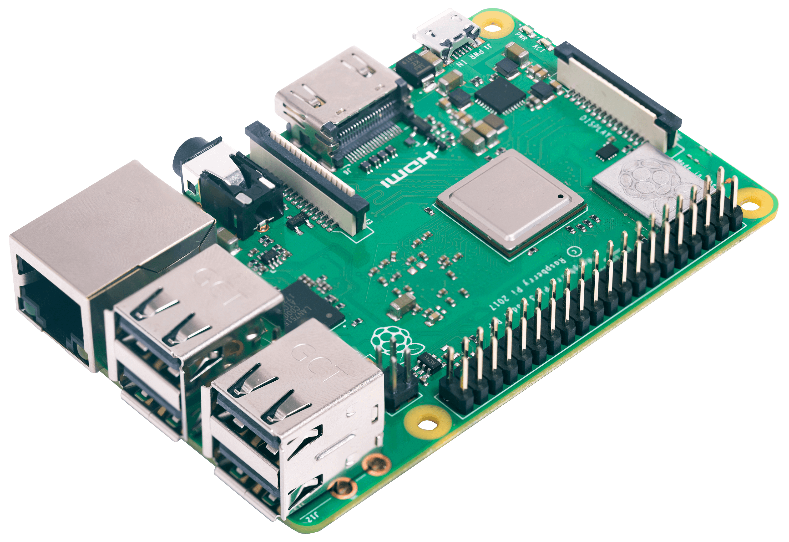

# 🛍️ Lista Pezzi

!!! tip "Scegli il tuo Budget"
    Abbiamo selezionato i migliori componenti per ogni fascia di prezzo, garantendo il miglior rapporto qualità/prezzo.

## 🏷️ Fasce di Prezzo

=== "🌱 Starter (30-50€)"

    ## 🌱 Budget Starter (30-50€)

    !!! example "Componenti Entry-Level, per chi vuole iniziare con un investimento minimo"

    ### 🖥️ Raspberry PI 3

    

    -   [x] **Caratteristiche Principali**

        - CPU Quad-Core 1.2GHz
        - 1GB RAM
        - WiFi + Bluetooth integrati
        - GPIO pins per sensori

        [→ Acquista a 29.99€](#){ .md-button }

    

    

    ### 📊 Sensori Base

    

    -   🌡️ **Kit Sensori**

        - Sensore temperatura DHT11
        - Sensore pressione BMP180
        - Cavi di collegamento

        [→ Acquista a 19.99€](#){ .md-button }

    

    !!! success "Totale Configurazione: 49.98€"
        ✅ Perfetto per iniziare
        ✅ Facilmente espandibile
        ✅ Ottimo per imparare

=== "🌿 Intermedio (60-75€)"

    ## 🌿 Budget Intermedio (60-75€)

    !!! example "Componenti di qualità superiore per risultati affidabili e prestazioni migliori"

    ### 🖥️ Raspberry PI 4 Model B

    

    -   [x] **Caratteristiche Principali**

        - CPU Quad-Core 1.5GHz
        - 2GB RAM
        - WiFi 5GHz + Bluetooth 5.0
        - USB 3.0 e Gigabit Ethernet
        - GPIO pins per sensori

        [→ Acquista a 45.99€](#){ .md-button }

    

    

    ### 📊 Kit Sensori Avanzato

    

    -   🌡️ **Kit Sensori Pro**

        - Sensore temperatura/umidità DHT22
        - Sensore pressione BMP280
        - Sensore qualità aria MQ135
        - Cavi e breadboard

        [→ Acquista a 29.99€](#){ .md-button }

    

    !!! success "Totale Configurazione: 75.98€"
        ✅ Prestazioni superiori
        ✅ Sensori più precisi
        ✅ Maggiore espandibilità

=== "🌳 Alto (80-90€)"

    ## 🌳 Budget Alto (80-90€)

    !!! example "Setup semi-professionale con componenti di alta qualità"

    ### 🖥️ Raspberry PI 4 Model B 4GB

    

    -   [x] **Caratteristiche Premium**

        - CPU Quad-Core 1.8GHz
        - 4GB RAM
        - WiFi 5GHz + Bluetooth 5.0
        - USB 3.0 e Gigabit Ethernet
        - Ventola di raffreddamento inclusa

        [→ Acquista a 59.99€](#){ .md-button }

    

    ### 📊 Kit Sensori Professionale

    

    -   🌡️ **Kit Sensori Premium**

        - Sensore BME280 (temp/umidità/pressione)
        - Anemometro
        - Sensore pioggia
        - Display OLED
        - Cavi e componenti premium

        [→ Acquista a 29.99€](#){ .md-button }

    

    !!! success "Totale Configurazione: 89.98€"
        ✅ Componenti professionali
        ✅ Misurazioni precise
        ✅ Setup completo

=== "💎 Premium (100-125€)"

    ## 💎 Budget Premium (100-125€)

    !!! example "Configurazione professionale per risultati da stazione meteo certificata"

    ### 🖥️ Raspberry PI 4 Model B 8GB

    

    -   [x] **Caratteristiche Ultimate**

        - CPU Quad-Core 1.8GHz OC
        - 8GB RAM
        - Case in alluminio con raffreddamento
        - Alimentatore ufficiale 3A
        - SSD 128GB

        [→ Acquista a 79.99€](#){ .md-button }

    

    ### 📊 Kit Sensori Elite

    

    -   🌡️ **Kit Sensori Deluxe**

        - Stazione meteo 7-in-1
        - Display LCD touchscreen
        - Sensore UV
        - Pluviometro di precisione
        - Kit montaggio professionale

        [→ Acquista a 44.99€](#){ .md-button }

    

    !!! success "Totale Configurazione: 124.98€"
        ✅ Qualità professionale
        ✅ Precisione certificata
        ✅ Setup completo e duraturo

=== "⭐ Avanzato (150-200€)"

    ## ⭐ Budget Avanzato (150-200€)

    !!! example "Il meglio che il mercato offre per uso professionale e ricerca"

    ### 🖥️ Kit Completo Raspberry PI 4 8GB

    

    -   [x] **Setup Ultimate**

        - Raspberry PI 4 8GB
        - Case raffreddato a liquido
        - SSD NVMe 256GB
        - Display 7" touch ufficiale
        - UPS integrato

        [→ Acquista a 129.99€](#){ .md-button }

    

    ### 📊 Stazione Meteo Professionale

    

    -   🌡️ **Kit Meteorologico Pro**

        - Stazione meteo Davis Vantage Vue
        - Shield solare ventilato
        - Camera meteo 4K
        - Software professionale
        - Calibrazione certificata

        [→ Acquista a 69.99€](#){ .md-button }

    

    !!! success "Totale Configurazione: 199.98€"
        ✅ Qualità scientifica
        ✅ Certificazione professionale
        ✅ Supporto prioritario